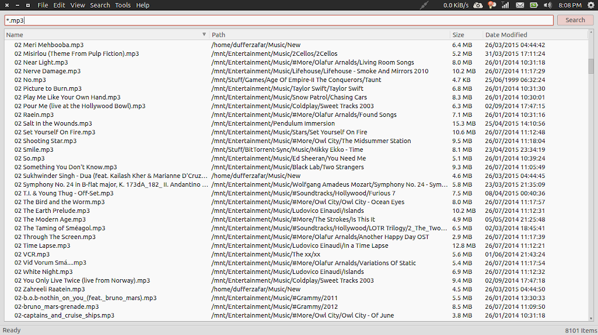

# loki

PyQt based frontend for locate tool.

Initial version created in a stretch of 6 hours on Tue, 05 May 2015 from 2 to 8 PM.

# Hotkeys

`Ctrl + F` - Focus search bar

`Ctrl + L` - Clear all items

`Ctrl + Q` - Quit application

# Todo

* Go through Catfish's source

* File Icons

* Restrict search to a particular folder

* Tab order
* Pressing enter on an item opens it
* Context menu to open folder (ctrl+enter)

* Advanced query syntax?
  * size > 1 M
  * modified < 2 Weeks

# Similar Stuff

* [Catfish](https://help.ubuntu.com/community/Catfish)

* [Everything for Windows](http://www.voidtools.com/)
